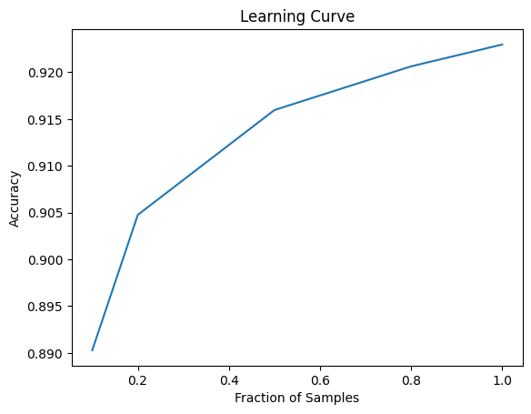

# NLP DecisionTree Context-sensitive spelling correction

## Introduction
Implemented in Python a simple ID3-like decision tree learning algorithm and test it on a data set for context-sensitive spelling correction.

## [Dataset](hw1_dataset)
The dataset used to train and test the model is pre-labelled. Train/ Val/ Test dataset are provided separately.
Each line represents a single example sentence containing one of the target words. The first column on each line represents the label (“whether” or “weather”); the second column is the index of the target word in the sentence (starting from 0); the rest of the line includes the sentence itself. Columns are space-separated. The sentences have already been lowercased and tokenized.

## [Feature Engineering](utils.py)
Used contextual words features
1. Validate the target word's position in the sentence
2. Create list of words occurring before and after the target within specified context window
3. Create vocabulary based on words list from step 2
4. Construct one hot mapping dictionary for the vocabulary, which will be re-used on Train/ Dev/ Test dataset
5. Produce Contextual word features using one hot mapping dictionary from step 4

## [Decision Tree implementation](decisiontree.py):
Fit the Decision Tree:
1. Calculate entropy, Information Gain for each feature 
2. Pick best split feature, which has the highest Information Gain
3. Grow the DT until meets the stop criteria(i.e. the tree is deep enough, or only one class label is left, or left sample is less than min_sample_split, or is pure enough) 

Inference on Dev/ Test dataset:
1. Traverse the tree to produce the Prediction on Test dataset 

Evaluate model performance with Accuracy score.

## Experiments and models performance
1. [Train DT with Different Context Window](DTFeaturesHeight.ipynb):
   1. One word before the target -- Val_accuracy = 0.7561
   2. One word after the target -- Val_accuracy = 0.7518
   3. One word before and one word after the target -- Val_accuracy = 0.9293, Test_accuracy = 0.9216
**Evaluation**: Training model with both the words before and after the target, performs much better than the other two and the test accuracy is over 90%. 
   One possible explanation is that both the before and after words are good features, therefore having them achieves high accuracy. 
   Moreover, they are not correlated, therefore having them both performs much better than only either one of them.
2. [Train DT with Different depth of the tree](DTFeaturesHeight.ipynb):
   1. Max height = 3 -- Val_accuracy = 0.8389
   2. Max height = 10 -- Val_accuracy = 0.8753
   3. Without height limit -- Test_accuracy = 0.9216
**Evaluation**: Training the model without tree height limit performances the best.
The smaller the max height, the worse the model performs. This is inline with how the decision tree model works: the sooner you stop the tree from branching, the decision is less precise.
3. [Train DT with Different training set data size](LearningCurve.ipynb)
   Plot of # of training set size vs. testing accuracy


**Evaluation**: The model accuracy increases as training set data size increases. 
The performance increases steep when data set is less than 50% of entire train set. 
After exceeds 50% of entire train set, the increment slows down a lot, with the accuracy around 0.9. 
It indicates that in order to achieve even higher accuracy above 90%, either an exponentially larger sample size is necessary or sample size alone will not increase accuracy and additional features are needed.

## How to run the project to reproduce the experiments mentioned above:
1. pip install requirements.txt
2. To re-generate "hw1.train_mid_rnd.col", run below commands(for Mac user):
   ```commandline
   brew install coreutils
   gshuf -n 5000 hw1.train.col > hw1.train_mid_rnd.col
   ``` 
   Or can just use already generated "hw1.train_mid_rnd.col" under directory hw1_dataset/
   Note: "hw1.train_mid_rnd.col" is randomly selected 5000 samples, which is approved can provide reasonable good enough performance
3. open jupyter notebook, run each notebook: 
   1. DTFeaturesHeight.ipynb -- Experiment on which Features performance better. Then how does Height affects DT performance.
   2. LearningCurve.ipynb -- Experiment on learning curve based on different training data size
